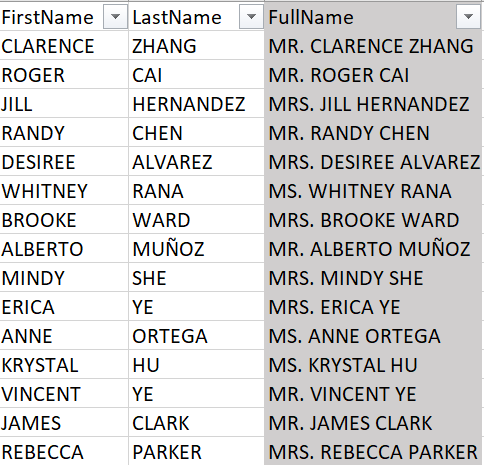

# Data Transformation with Excel

In this project, I use Excel to transform a supperstore data set for data analysis.

## Skill/ Concepts Demonstrated
- Concat
- TEXT
- IF/S
- LEFT/RIGHT
- FIND
- COUNT/A
- COUNTIF
- SUM
- AVERAGE

## Transformation
The data consists of columns, namely CustomerKey, Prefix, First name, Last name, Birthdate, Marital Status, Gender, Email address, Annual Income, Education Level, Occupation, and Home Owner. The transformation goes as follows:
1. I Insert a new column after **LastName** and name it **FullName** and Formulate the FullName column by joining the **Prefix**, **FirstName**, and **LastName** 
together, separated by a space using **CONCAT**.

                     

2. I Insert a new column after Birthdate and name it **Year of Birth.** and i formulate the “Year of Birth” column by extracting the year from the BirthDate using **TEXT** function

                                                    

3. I Insert a new column after **MaritalStatus** and name it **Marital Status Full** and Formulate the **Marital Status Full** column by Changing the “S” to “Single” and the “M” to Married.” using **IF statement.**

                             

4. I Insert a new column after **Gender** and name it **Gender Full.**” Formulate the “Gender Full” column by Changing the “F” to “Female” and the “M” to “male” using an **IF statement.**

                            

   
5. Insert a new column after **Email Address** and name it **Username.**”  Formulate the Username column by extracting all the words before the “@” using **LEFT** and **FIND** function.

                                                   

6. I Format **AnnualIncome** column to currency ($) Insert a new column after **AnnualIncome** and name it **Wealth Category** In the Wealth Category column, I write a formula to check the wealth level of the customers and return:
- **Wealthy** if AnnualIncome is greater than or equal to 150,000
- **Rich** if AnnualIncome is greater than or equal to 100,000
-  **Average** if AnnualIncome is greater than or equal to 50,000
-  **Poor** if AnnualIncome is less than 50,000

                                                

  

## Some Analysis of the Data

1. I Create a new sheet and name it **Summary.** Merge A1:B1 and name it **Customer Summary**. Format background to be dark green colour 
and bold white font.
• I Compute the corresponding result beneath and make sure they are visible
shown:
- Total Customers – total number of customers
- 1956 – number of customers born in year 1956
- Single – number of customers that are single
- Female - number of customers that are female
- Total Annual Income – Total income of all customers
- Average Annual Income: – average income of all Customers
- Rich - number of customers that are rich
- High School - number of customers that are in high school
- Male Bachelors - number of customers that are male and bachelors
- Graduate Degree – average salary of graduate degree holders
- Professional (90,000) - number of professional customers that earn more than 90,000

